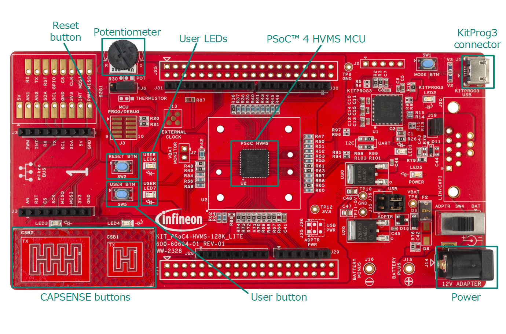
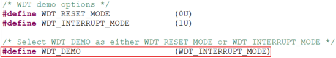
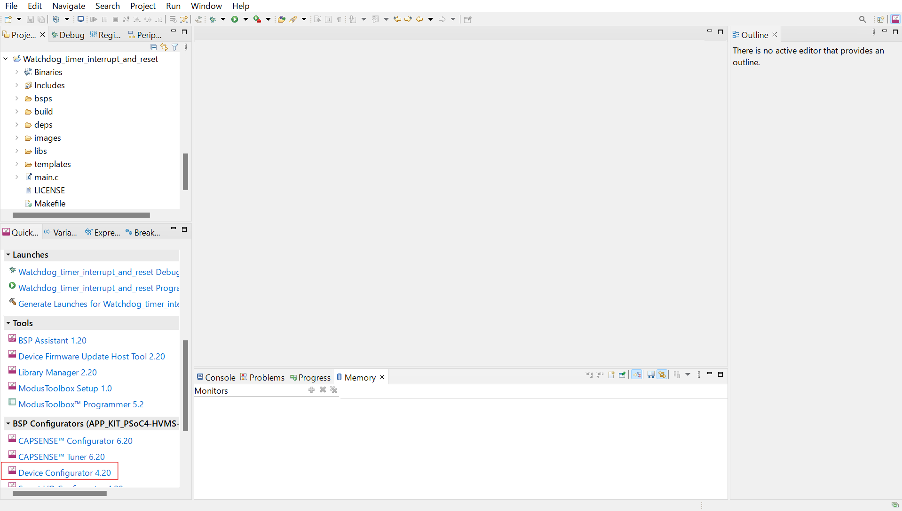
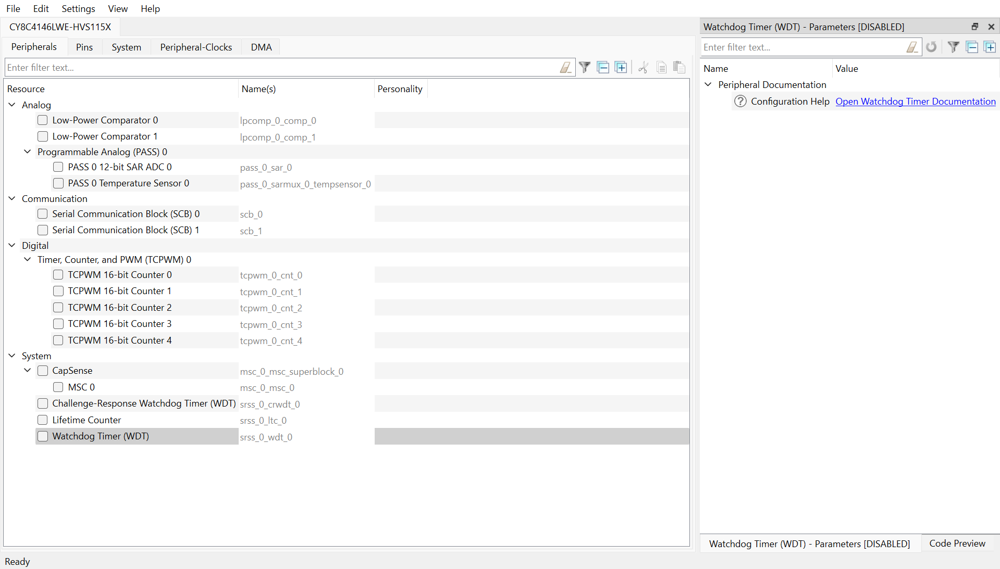
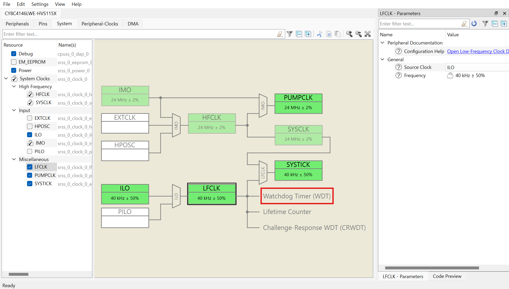
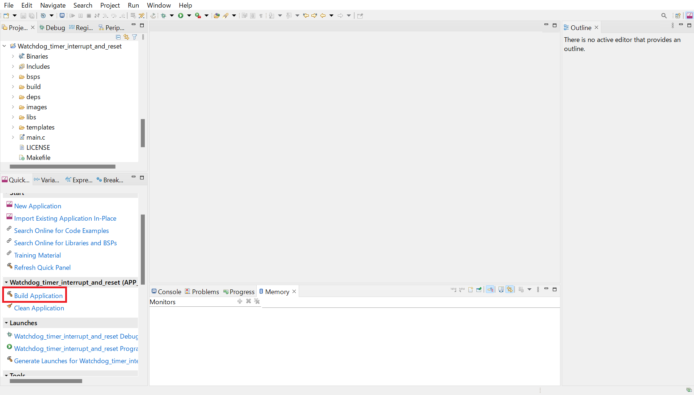

# PSoC&trade; 4: Watchdog timer interrupt and reset
**This example demonstrates how watchdog timer works with the interrupt mode and the reset mode.**

## Device

The device used in this code example (CE) is:
- [PSoC™ 4 HVMS Series (High Voltage Mixed Signal)](https://www.infineon.com/cms/en/product/microcontroller/32-bit-psoc-arm-cortex-microcontroller/32-bit-psoc-4-hv-arm-cortex-m0/)

## Board
The board used for testing is:
- PSoC&trade; 4 HVMS Lite Kit ([KIT_PSoC4-HVMS-128K_LITE](https://www.infineon.com/cms/en/product/evaluation-boards/psoc4_hvms_lite_kit/))
- PSoC&trade; 4 HVMS Lite Kit ([KIT_PSoC4-HVMS-64K_LITE](https://www.infineon.com/cms/en/product/evaluation-boards/psoc4_hvms_lite_kit/))

## Scope of work
This code example deals with the watchdog timer (WDT) of PSoC&trade; 4. The WDT operates in two modes: the interrupt mode and the reset mode. In the interrupt mode, the LED toggles every second. If it's configured as the reset mode, the LED blinks thrice with an interval of 200 milliseconds each time the watchdog reset occurs.

## Introduction  
The WDTs are used to automatically reset the device in the event of an unexpected firmware execution path. They are also used as a wakeup source to periodically generate interrupts as a wakeup source in low-power modes.
There are several WDT functionalities in PSoC&trade; 4 HVMS devices. These are:
- Basic WDT
- Challenge-response WDT (CRWDT)
- Lifetime counter with wakeup capability.

The basic WDT is a free-running up-counter with programmable limit values and a maximum resolution of 32 bits, as featured in this code example.
- 32-bit counter and compares, clocked by LFCLK
- Lower, Warn, and Upper limits with programmable actions for each
- Implemented in VCCD logic domain

More details can be found in:
- PSoC&trade; 4 HVMS Series
  - [Architecture TRM](https://www.infineon.com/cms/en/product/microcontroller/32-bit-psoc-arm-cortex-microcontroller/32-bit-psoc-4-hv-arm-cortex-m0/)
  - [Registers TRM](https://www.infineon.com/cms/en/product/microcontroller/32-bit-psoc-arm-cortex-microcontroller/32-bit-psoc-4-hv-arm-cortex-m0/)
  - [Data Sheet](https://www.infineon.com/cms/en/product/microcontroller/32-bit-psoc-arm-cortex-microcontroller/32-bit-psoc-4-hv-arm-cortex-m0/)

## Hardware setup

This Code Example has been developed for:
- [KIT_PSoC4-HVMS-128K_LITE](https://www.infineon.com/cms/en/product/evaluation-boards/psoc4_hvms_lite_kit/) 
- [KIT_PSoC4-HVMS-64K_LITE](https://www.infineon.com/cms/en/product/evaluation-boards/psoc4_hvms_lite_kit/) 

**Figure 1. KIT_PSoC4-HVMS-128K_LITE (Top View)**
  

## Implementation

The firmware is implemented in *main.c* and performs the following functions:

1. Enable WDT interrupt
2. Initialize and start WDT
3. LED6 toggles every second if it's the interrupt mode
4. LED6 blinks thrice each time the reset occurs if it's the reset mode

**You can change the interrupt mode/the reset mode by changing the macro**

**Figure 2. The macro to change the mode**
  

 

**ModusToolbox&trade; Device configurator**

This code example project can be created or imported using ModusToolbox&trade; IDE. To configure the project in the **Quick Panel**, click on **Device Configurator**.
You can configure peripheral and clock settings on **Device Configurator**. You can see **Watchdog Timer (WDT)** clock is from LFCLK on **Clock System**.

**Figure 3. Select Device Configurator**
  

**Figure 4. Device Configurator**
  

**Figure 5. Clock System**
  

 

**PDL functions**
- <a href="https://infineon.github.io/mtb-pdl-cat2/pdl_api_reference_manual/html/group__group__syslib__functions.html#gac8aa61d2f8052886c676f4f592d1693d"><i>Cy_SysLib_GetResetReason()</i></a> is used to get the reset reason to check if the reset caused by WDT reset.
- <a href="https://infineon.github.io/mtb-pdl-cat2/pdl_api_reference_manual/html/group__group__syslib__functions.html#gaebb4e952584f0c428f58f7b4dbd3ceff"><i>Cy_SysLib_ClearResetReason()</i></a> is used to clear reset cause register.
- <a href="https://infineon.github.io/mtb-pdl-cat2/pdl_api_reference_manual/html/group__group__syslib__functions.html#gaad1c32546fdb0e3c6fa8b46fb95843b5"><i>Cy_SysLib_Delay()</i></a> is used to make an interval between LED ON/LED OFF.
- <a href="https://infineon.github.io/mtb-pdl-cat2/pdl_api_reference_manual/html/group__group__sysint__functions.html#gab2ff6820a898e9af3f780000054eea5d"><i>Cy_SysInt_Init()</i></a> is used to set interrupt source and interrupt handler.
- <a href="https://infineon.github.io/mtb-pdl-cat2/pdl_api_reference_manual/html/group__group__gpio__functions__gpio.html#ga849c813d6771bf8d3c59b89b28a07bca"><i>Cy_GPIO_Write()</i></a> is used to change LED state.
- <a href="https://infineon.github.io/mtb-pdl-cat2/pdl_api_reference_manual/html/group__group__gpio__functions__gpio.html#ga5c6e1b88d80a5b9fcdb215273e7cf058"><i>Cy_GPIO_Inv()</i></a> is used to invert the LED state.
- <a href=""><i>Cy_WDT_Unlock()</i></a> is used to unlock WDT register.
- <a href=""><i>Cy_WDT_Lock()</i></a> is used to lock WDT register.
- <a href=""><i>Cy_WDT_SetLowerLimit()</i></a> is used to set lower limit.
- <a href=""><i>Cy_WDT_SetUpperLimit()</i></a> is used to set upper limit.
- <a href=""><i>Cy_WDT_SetWarnLimit()</i></a> is used to set warn limit.
- <a href=""><i>Cy_WDT_SetLowerAction()</i></a> is used to set the action that occurs if the service is set before the count is lower limit.
- <a href=""><i>Cy_WDT_SetUpperAction()</i></a> is used to set the action that occurs if the service isn't set although the count is over upper limit.
- <a href=""><i>Cy_WDT_SetWarnAction()</i></a> is used to set the action that occurs if the service isn't set although the count is over warn limit.
- <a href=""><i>Cy_WDT_SetAutoService()</i></a> is used to set auto service that occurs if the count reaches to the warn limit.
- <a href=""><i>Cy_WDT_SetDeepSleepPause()</i></a> is used to set whether the WDT counter runs/pauses when the system is in DEEPSLEEP.
- <a href=""><i>Cy_WDT_SetDebugRun()</i></a> is used to set whether the WDT counter runs/pauses when the system is in debug mode.
- <a href="https://infineon.github.io/mtb-pdl-cat2/pdl_api_reference_manual/html/group__group__wdt__functions.html#ga709f597d56e7f7fb6717d5ff671491fa"><i>Cy_WDT_Disable()</i></a> is used to disable WDT.
- <a href="https://infineon.github.io/mtb-pdl-cat2/pdl_api_reference_manual/html/group__group__wdt__functions.html#ga82aec7e454d05d03dfd1d6fd5e573d5e"><i>Cy_WDT_Enable()</i></a> is used to enable WDT.
- <a href="https://infineon.github.io/mtb-pdl-cat2/pdl_api_reference_manual/html/group__group__wdt__functions.html#ga05f8bb5603ce46caf842bd0ad254f604"><i>Cy_WDT_IsEnabled()</i></a> is used to check if WDT is enabled.
- <a href=""><i>Cy_WDT_SetService()</i></a> is used to service WDT then the count is cleared.
- <a href="https://infineon.github.io/mtb-pdl-cat2/pdl_api_reference_manual/html/group__group__wdt__functions.html#ga727d9ae6fdba36809bf631985a3eb987"><i>Cy_WDT_ClearInterrupt()</i></a> is used to clear WDT interrupt flag.
- <a href="https://infineon.github.io/mtb-pdl-cat2/pdl_api_reference_manual/html/group__group__wdt__functions.html#gab6caa17bf5bcb0c365f60e602e653fed"><i>Cy_WDT_MaskInterrupt()</i></a> is used to prevent from WDT interrupt passes to the CPU.
- <a href="https://infineon.github.io/mtb-pdl-cat2/pdl_api_reference_manual/html/group__group__wdt__functions.html#ga38c69c98675d6024a7d73acb41b24399"><i>Cy_WDT_UnmaskInterrupt()</i></a> is used to unmask WDT interrupt and make WDT interrupt pass to the CPU.

## Compiling and programming
Before testing this code example:  
- Power the board through the dedicated power connector 
- Connect the board to the PC through the USB interface
- Build the project using the dedicated Build button
 

**Figure 6. Build Project**
   or by right-clicking the project name and selecting "Build Project"
- To program the board, in the **Quick Panel**, scroll down, and click **[Project Name] Program (KitProg3_MiniProg4)**

## Run and Test

- After programming, the code example will start automatically and you can see
 - The LED6 toggles every second in the interrupt mode
 - The LED6 blinks thrice with an interval of 200 milliseconds each time the watchdog reset occurs in the reset mode

- You can debug the example to step through the code. In the IDE, use the **[Project Name] Debug (KitProg3_MiniProg4)** configuration in the **Quick Panel**. For details, see the "Program and debug" section in the [Eclipse IDE for Toolbox™ software user guide](https://www.cypress.com/MTBEclipseIDEUserGuide).

**Note:** **(Only while debugging)** On the CM7 CPU, some code in *main()* may execute before the debugger halts at the beginning of *main()*. This means that some code executes twice: once before the debugger stops execution, and again after the debugger resets the program counter to the beginning of *main()*. See [KBA231071](https://community.cypress.com/docs/DOC-21143) to learn about this and for the workaround.

## References  
Relevant Application notes are:
- AN0034 - Getting started with PSOC&trade; 4 HV MS MCUs in ModusToolbox&trade;

ModusToolbox&trade; is available online:
- <https://www.infineon.com/modustoolbox>

Associated PSoC&trade; 4 HVMS MCUs can be found on:
- <https://www.infineon.com/cms/en/product/microcontroller/32-bit-psoc-arm-cortex-microcontroller/32-bit-psoc-4-hv-arm-cortex-m0/>

More code examples can be found on the GIT repository:
- <https://github.com/Infineon/Code-Examples-for-ModusToolbox-Software>

For additional trainings, visit our webpage:  
- <https://www.infineon.com/cms/en/product/microcontroller/32-bit-psoc-arm-cortex-microcontroller/32-bit-psoc-4-hv-arm-cortex-m0/#!trainings>

For questions and support, use the PSoC&trade; 4 HVMS Forum:  
- <https://community.infineon.com/t5/PSoC-4/bd-p/psoc4>
